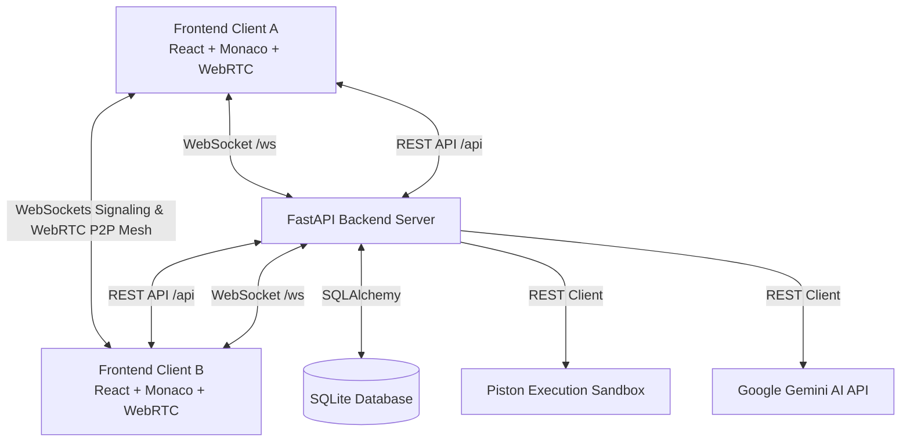

# Collaborative CodeSpace IDE

A modern, real-time collaborative cloud IDE that allows developers to code together seamlessly with synchronized file trees, live multi-cursor Monaco editing, built-in room chat, peer-to-peer WebRTC video/audio calls, multi-language sandboxed code execution, and an integrated AI coding assistant.

---

## 📌 Problem Solved

Traditional code editors operate in silos. Pair programming, technical interviews, team sprints, and remote troubleshooting frequently require juggling separate tools for video calls, screen sharing, chat, code execution, and Git branches. 

**Collaborative CodeSpace IDE** unifies this workflow into a single browser-based workspace where teams can:
- Instantly spin up collaborative workspaces without complex setup.
- Simultaneously edit code across multi-file projects with sub-millisecond synchronization.
- Execute code in sandboxed runtime environments without leaving the editor.
- Communicate over real-time text chat and peer-to-peer WebRTC video calls.
- Leverage context-aware AI suggestions and debugging assistance directly in the editor.

---

## ✨ Key Features

- **⚡ Real-Time Multi-User Collaboration**: Low-latency WebSocket synchronization for file content changes, remote cursor tracking, active member presence, and live file tree modifications.
- **💻 Monaco Editor Core**: Full-featured code editor powering syntax highlighting, line numbers, folding, indentation guides, and multi-file tab switching.
- **🚀 Multi-Language Code Execution**: Sandboxed execution pipeline supporting Python, JavaScript, TypeScript, C++, Java, Rust, Go, and more via Piston API.
- **🤖 Integrated AI Assistant**: In-room AI conversational assistant powered by Google Gemini for code explanation, refactoring, documentation generation, and bug fixing.
- **💡 Inline AI Code Completion**: Smart autocomplete triggered directly from the Monaco editor toolbar.
- **💬 Real-Time Room Chat**: Synchronized in-editor group chat with timestamps and sender badges.
- **📹 WebRTC Audio & Video Dock**: Low-latency peer-to-peer audio and video calling with camera/mic toggles for instant pair programming.
- **📁 Dynamic Multi-File Workspace**: Create, switch, and manage files in the project tree with automatic language detection.
- **🔐 Session & Room Security**: JWT-based authentication, password-protected or open collaboration rooms, and scoped access control.

---

## 🏗️ System Architecture



---

## 🛠️ Technology Stack

### Frontend
- **Framework**: React 19 + TypeScript
- **Bundler & Tooling**: Vite 8, Tailwind CSS v4, Oxlint
- **Editor**: Monaco Editor (`@monaco-editor/react`)
- **Icons & UI**: Lucide React
- **Real-Time Communication**: Native WebSockets + WebRTC (`RTCPeerConnection`)

### Backend
- **Framework**: FastAPI (Python 3.10+)
- **Server**: Uvicorn (ASGI)
- **Database**: SQLite with SQLAlchemy 2.0 ORM & Alembic migrations
- **Authentication**: JWT (JSON Web Tokens) with `passlib` & `bcrypt`
- **Real-Time Engine**: `websockets` + Async In-Memory Connection Hub
- **Sandbox Execution**: Piston API integration
- **AI Engine**: Google Gemini API client integration

---

## 📂 Project Structure

```
Collaborative-CodeSpace-IDE/
├── backend/
│   ├── app/
│   │   ├── routers/
│   │   │   ├── auth.py          # User registration, login, profile
│   │   │   ├── rooms.py         # Room creation, joining, file management
│   │   │   ├── ws.py            # WebSocket event handling & broadcasting
│   │   │   ├── execution.py     # Multi-language code execution
│   │   │   └── ai.py            # Gemini AI code assistant & completion
│   │   ├── auth.py              # JWT token encoding, decoding & verification
│   │   ├── config.py            # Environment configuration & defaults
│   │   ├── database.py          # SQLAlchemy database connection & session
│   │   ├── main.py              # FastAPI app initialization & CORS
│   │   ├── models.py            # User, Room, File, Message ORM models
│   │   ├── schemas.py           # Pydantic request/response schemas
│   │   └── websocket_manager.py # Room-scoped WebSocket connection manager
│   ├── requirements.txt         # Python dependencies
│   └── codespace.db             # Local SQLite database (git-ignored)
├── frontend/
│   ├── src/
│   │   ├── components/          # Workspace, EditorPanel, ChatPanel, VideoCallPanel, etc.
│   │   ├── context/             # AuthContext session provider
│   │   ├── services/            # API client, WebSocket manager, WebRTC peer service
│   │   ├── types/               # TypeScript interfaces & definitions
│   │   ├── App.tsx              # Main routing & application state
│   │   └── main.tsx             # React DOM root entry
│   ├── package.json             # Frontend dependencies & scripts
│   └── vite.config.ts           # Vite build config & backend API proxy
├── tests/
│   ├── test_backend.py          # REST API & auth integration tests
│   ├── test_websocket.py        # Real-time sync & WebSocket test suite
│   ├── test_full_e2e.py         # End-to-end multi-user workflow test
│   └── test_all_languages.py    # Sandbox execution tests across 10 languages
├── .env.example                 # Template for environment variables
└── .gitignore                   # Ignore rules for secrets, builds & dependencies
```

---

## 🚀 Quickstart & Local Setup

### 1. Prerequisites
- Python 3.10 or higher
- Node.js 18 or higher (npm / pnpm / yarn)

### 2. Backend Setup
```bash
# Navigate to backend directory
cd backend

# Create and activate virtual environment (optional but recommended)
python -m venv .venv
# On Windows:
.venv\Scripts\activate
# On Linux/macOS:
source .venv/bin/activate

# Install dependencies
pip install -r requirements.txt

# Start FastAPI backend server
python -m uvicorn app.main:app --reload --host 127.0.0.1 --port 8000
```

The backend server will run at `http://127.0.0.1:8000`.  
Interactive API documentation is accessible at `http://127.0.0.1:8000/docs`.

### 3. Frontend Setup
```bash
# In a new terminal, navigate to frontend directory
cd frontend

# Install node dependencies
npm install

# Start Vite development server
npm run dev
```

The frontend application will run at `http://localhost:5173`.

---

## ⚙️ Environment Configuration

Copy `.env.example` to `.env` to configure optional custom settings:

```bash
cp .env.example .env
```

| Variable | Default | Description |
| :--- | :--- | :--- |
| `ENVIRONMENT` | `development` | Deployment environment mode |
| `PORT` | `8000` | Backend server port |
| `FRONTEND_URL` | `http://localhost:5173` | Allowed CORS origin for frontend client |
| `DATABASE_URL` | `sqlite:///./codespace.db` | SQLAlchemy database connection URI |
| `JWT_SECRET` | *(development fallback)* | Secret key for signing authentication tokens |
| `AI_API_KEY` | *(empty)* | Optional Google Gemini API key for AI assistant |
| `PISTON_API_URL`| `https://emkc.org/api/v2/piston` | Sandbox code execution endpoint |

---

## 🧪 Running Tests

The test suite validates authentication, room management, real-time WebSocket messaging, and sandboxed code execution:

```bash
# Run backend REST API test suite
python tests/test_backend.py

# Run WebSocket multi-client synchronization tests
python tests/test_websocket.py

# Run complete End-to-End multi-user workflow tests
python tests/test_full_e2e.py

# Run multi-language execution suite
python tests/test_all_languages.py
```

Frontend type checking and bundle validation:
```bash
cd frontend
npm run build
npm run lint
```

---

## 🔒 Security Best Practices

- **Zero Secrets Tracked**: `.env` and sensitive credential files are excluded from version control.
- **Isolated Execution**: Code execution takes place via an isolated, sandboxed runtime without server filesystem access.
- **Sanitized Outputs**: Runtime errors and execution responses are sanitized before delivery to connected clients.
- **Scoped Room Authorization**: Users must authenticate and join with valid room tokens to access collaboration streams.

---

## 📄 License

This project is licensed under the MIT License.
